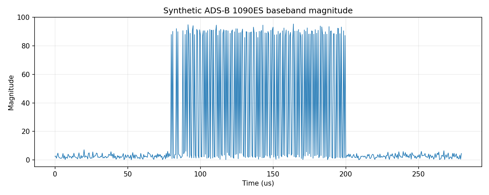
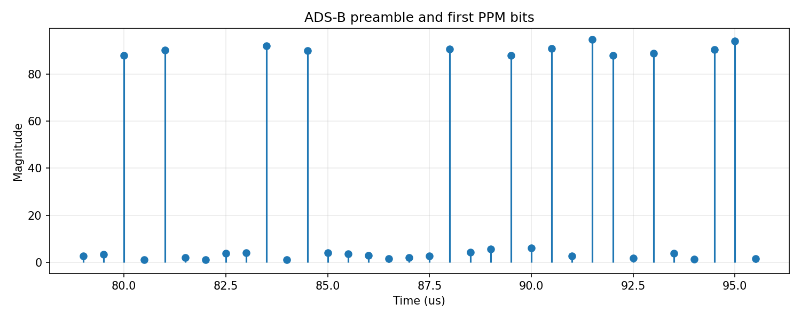
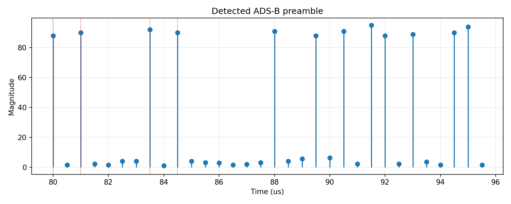
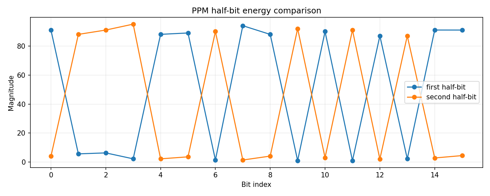

# ADS-B 1090ES PPM 调制与解调仿真

## 摘要

本文使用 Python 对 ADS-B / Mode-S 1090ES 信号进行 PPM 调制、RTL-SDR 风格 unsigned 8-bit IQ 保存、IQ 读取、前导码检测、PPM 判决和 24-bit parity 校验。仿真参数与当前 C++ 解码器保持一致：射频中心频率标注为 `1090 MHz`，复基带 IQ 采样率为 `2 MS/s`，数据速率为 `1 Mbps`，前导码为 `8 us`，长帧为 `112 bit`。

需要注意的是，脚本没有用 GHz 级采样率直接离散 1090 MHz 射频载波，而是模拟 RTL-SDR 调谐到 `1090 MHz` 后输出的复基带 IQ。这与 `rtl_sdr -f 1090000000 -s 2000000` 捕获文件的形态一致，也与 `ADSBDemodulator::processIq()` 的输入假设一致。

## 1. 仿真文件

| 文件 | 作用 |
| --- | --- |
| `ADS-B_iq_io.py` | 读写 RTL-SDR 风格 unsigned 8-bit interleaved IQ |
| `ADS-B_modulation.py` | 生成 DF17 ADS-B callsign 消息、PPM 脉冲和 `ADS-B_1090ES.iq` |
| `ADS-B_demodulation.py` | 读取 IQ，检测前导码，恢复 bit，校验 parity 并打印消息字段 |
| `ADS-B_1090ES.iq` | Python 生成的 unsigned 8-bit interleaved IQ 数据 |
| `figures/*.png` | 调制与解调关键过程图 |

运行方式：

```bash
pixi run sim-ADS-B-mod
pixi run sim-ADS-B-demod
```

或者一次完成调制和解调：

```bash
pixi run sim-ADS-B
```

## 2. 系统参数

| 参数 | 数值 | 说明 | 代码对应 |
| --- | ---: | --- | --- |
| $f_c$ | 1090 MHz | ADS-B RF 中心频率 | `CENTER_FREQ_HZ` |
| $F_s$ | 2 MHz | 保存 IQ 的复采样率 | `SAMPLE_RATE_HZ` |
| $R_b$ | 1 Mbps | Mode-S PPM bit rate | `BITS_PER_SECOND` |
| $T_b$ | 1 us | 每个 bit 时间 | `1 / BITS_PER_SECOND` |
| $N_b$ | 2 samples/bit | 每 bit 的采样点数 | `SAMPLES_PER_BIT` |
| $T_p$ | 8 us | 前导码长度 | `PREAMBLE_US` |
| $N_p$ | 16 samples | 2 MS/s 下的前导码采样数 | `PREAMBLE_SAMPLES` |
| $L$ | 112 bit | DF17 长消息长度 | `LONG_MSG_BITS` |

由于：

$$
F_s=2\,000\,000
$$

且：

$$
R_b=1\,000\,000
$$

所以每个 bit 正好对应：

$$
N_b=\frac{F_s}{R_b}=2
$$

个 IQ 采样点。这个整数关系是本仿真和 C++ 解码器都采用 `2 MS/s` 的关键原因：每个 PPM bit 可以直接表示为“前半 bit 一个采样点、后半 bit 一个采样点”。

## 3. 为什么是 1090 MHz 的复基带 IQ

真实 ADS-B 发射端可以理解为在 1090 MHz 载波上发送短脉冲。简化 RF 表达为：

$$
s_\text{RF}(t)=A(t)\cos(2\pi f_c t+\phi)
$$

其中 $A(t)$ 是 PPM 脉冲包络，$f_c=1090\,\text{MHz}$。RTL-SDR 调谐到 1090 MHz 后会把射频信号下变频为复基带：

$$
x(t)=A(t)e^{j\phi}+w(t)
$$

这里 $w(t)$ 是复噪声。脚本中为了突出 PPM 和解码链路，使用常相位 $\phi=0$，因此脉冲主要加在 I 分量上：

```python
iq = noise_i + 1j * noise_q
iq[offset : offset + MESSAGE_SAMPLES] += envelope.astype(np.complex64)
```

这并不表示真实信号没有 1090 MHz 载波，而是表示“接收机已经把 1090 MHz 载波搬移到了 0 Hz 附近”。因此文件中的 `ADS-B_1090ES.iq` 是调谐后的复基带 IQ，适合直接送入基于幅度的 Mode-S 解码器。

## 4. DF17 消息构造

本仿真生成一条 DF17 extended squitter callsign 消息。112-bit 长消息按字节表示为：

```text
DF/CA(8 bit), ICAO(24 bit), ME(56 bit), parity(24 bit)
```

代码入口是：

```python
message = make_df17_callsign_message(args.icao, args.callsign)
```

默认参数为：

```text
ICAO     = ABCDEF
Callsign = RTLSDR1
```

首字节由 DF 和 CA 拼成：

$$
b_0=(17 \ll 3) \;|\; 5
$$

其中 DF=17 表示 ADS-B extended squitter，CA=5 是示例 capability 字段：

```python
first_88.append((17 << 3) | 5)
first_88.extend(icao.to_bytes(3, "big"))
first_88.extend(encode_callsign_me(callsign))
```

### 4.1 Callsign ME 字段

callsign 属于 ADS-B Type Code 1-4 的 aircraft identification 消息。本脚本默认使用 Type Code 4。ME 字段一共 56 bit：

```text
Type Code(5 bit), Category(3 bit), 8 个 callsign 字符(8 * 6 bit)
```

数学上可以写成：

$$
\text{ME}=[TC_4\ldots TC_0,\;CAT_2\ldots CAT_0,\;C_0,\ldots,C_7]
$$

其中每个字符 $C_i$ 是 6-bit 字符表索引。代码对应：

```python
bits = [(type_code >> shift) & 1 for shift in range(4, -1, -1)]
bits.extend((category >> shift) & 1 for shift in range(2, -1, -1))
for char in normalized:
    code = MODE_S_CHARSET.find(char)
    bits.extend((code >> shift) & 1 for shift in range(5, -1, -1))
```

## 5. Mode-S parity / CRC

Mode-S 长消息最后 24 bit 是 parity。对 DF17 来说，接收端用它验证消息是否可信。本脚本使用与 C++ 解码器同源的 `MODES_CHECKSUM_TABLE`，对前 88 bit 计算 24-bit parity：

$$
P=\bigoplus_{i=0}^{87} b_i G_i
$$

其中 $b_i$ 是第 $i$ 个消息 bit，$G_i$ 是查表得到的 CRC 多项式贡献；只有 $b_i=1$ 时才异或该项。代码对应：

```python
crc = 0
for index, bit in enumerate(bits):
    if bit:
        crc ^= MODES_CHECKSUM_TABLE[index]
return crc & 0x00FFFFFF
```

发送消息为：

$$
M=[D_{0:87},P_{0:23}]
$$

解调端重新计算前 88 bit 的 parity，并与最后 24 bit 异或：

$$
S=P_\text{calc}\oplus P_\text{rx}
$$

若：

$$
S=0
$$

则认为 CRC/parity 校验通过。代码对应：

```python
received = int.from_bytes(message[-3:], "big")
return (crc ^ received) & 0x00FFFFFF
```

## 6. PPM 调制模型

ADS-B 1090ES 使用 PPM，Pulse Position Modulation。每个 bit 占用：

$$
T_b=1\,\mu s
$$

在 2 MS/s 下，每个 bit 有两个采样点：

```text
sample 0: 前半 bit，0.0-0.5 us
sample 1: 后半 bit，0.5-1.0 us
```

本仿真采用如下规则：

$$
b_k=1 \Rightarrow p[2k]=A,\quad p[2k+1]=0
$$

$$
b_k=0 \Rightarrow p[2k]=0,\quad p[2k+1]=A
$$

代码对应：

```python
sample_index = data_offset + bit_index * SAMPLES_PER_BIT + (0 if bit else 1)
envelope[sample_index] = amplitude
```

Mode-S 前导码长度为 8 us。2 MS/s 下有 16 个采样点，脚本把脉冲放在：

```python
PREAMBLE_PULSES = (0, 2, 7, 9)
```

也就是：

$$
t=\{0,\;1.0,\;3.5,\;4.5\}\,\mu s
$$

这与当前 C++ 解码器的前导码检测条件一致。

生成的整体幅度如下。图中前面是噪声底，随后出现一个 8 us 前导码加 112 us 数据区。因为每个 bit 只有一个半位有脉冲，所以数据区看起来是一串疏密由 bit 值决定的短脉冲。



前导码和开头若干个 PPM bit 的局部放大如下。前 8 us 内的四个固定脉冲用于帧同步，后面的每个 bit 通过前后半位的脉冲位置表示 1 或 0。



## 7. IQ 二进制格式

`ADS-B_1090ES.iq` 使用 RTL-SDR 常见的 unsigned 8-bit interleaved IQ：

```text
I0(uint8), Q0(uint8), I1(uint8), Q1(uint8), ...
```

中心值为：

$$
I_0=Q_0=127
$$

写文件时，复基带样本 $x[n]=I[n]+jQ[n]$ 被量化为：

$$
I_u[n]=\operatorname{clip}(\operatorname{round}(I[n]+127),0,255)
$$

$$
Q_u[n]=\operatorname{clip}(\operatorname{round}(Q[n]+127),0,255)
$$

代码对应：

```python
interleaved[0::2] = np.clip(np.rint(clipped_i + 127.0), 0, 255).astype(np.uint8)
interleaved[1::2] = np.clip(np.rint(clipped_q + 127.0), 0, 255).astype(np.uint8)
```

读取时再恢复为以 0 为中心的浮点复数：

$$
x[n]=(I_u[n]-127)+j(Q_u[n]-127)
$$

代码对应：

```python
centered = raw.astype(np.float32) - 127.0
return centered[0::2] + 1j * centered[1::2]
```

## 8. 解调流程

### 8.1 幅度检波

ADS-B 1090ES 的信息主要体现在脉冲有无和脉冲位置上，不依赖连续相位恢复。因此解调端先对 IQ 取幅度：

$$
r[n]=|x[n]|=\sqrt{I[n]^2+Q[n]^2}
$$

代码对应：

```python
iq = read_iq_u8(args.input)
magnitude = np.abs(iq)
```

### 8.2 前导码检测

在每个候选位置 $j$，脚本检查前导码高脉冲和低槽位是否满足相对大小关系。理想前导码位置为：

$$
\{j,\;j+2,\;j+7,\;j+9\}
$$

这些点应明显高于相邻空槽。代码中的核心判断是：

```python
m[j] > m[j + 1]
and m[j + 1] < m[j + 2]
and m[j + 2] > m[j + 3]
and m[j + 7] > m[j + 8]
and m[j + 9] > m[j + 6]
```

随后用高脉冲的平均值构造门限：

$$
H=\frac{r[j]+r[j+2]+r[j+7]+r[j+9]}{6}
$$

这里分母沿用当前 C++ 解码器的实现，用偏保守的阈值拒绝前导码中不该出现的高能量空槽：

```python
high = (m[j] + m[j + 2] + m[j + 7] + m[j + 9]) / 6.0
```

检测到的前导码如下。红色竖线标出了四个理论脉冲位置，用于观察脚本检测到的同步点是否与 Mode-S 前导码对齐。



### 8.3 PPM bit 判决

找到前导码后，数据区起点为：

$$
n_0=j+N_p
$$

第 $k$ 个 bit 的两个半位能量为：

$$
E_0[k]=r[n_0+2k]
$$

$$
E_1[k]=r[n_0+2k+1]
$$

判决规则为：

$$
\hat{b}_k=
\begin{cases}
1,&E_0[k]>E_1[k]\\
0,&E_0[k]\le E_1[k]
\end{cases}
$$

代码对应：

```python
first = magnitude[data_start + bit_index * SAMPLES_PER_BIT]
second = magnitude[data_start + bit_index * SAMPLES_PER_BIT + 1]
bits.append(1 if first > second else 0)
```

下图展示了前 16 个 bit 的前半位和后半位幅度比较。蓝线高于橙线的位置判为 1，橙线高于蓝线的位置判为 0。



### 8.4 字段解析

恢复 112 个 bit 后，脚本按 Mode-S 字节序打包：

```python
message = pack_bits(bits)
```

然后解析几个关键字段：

$$
DF=message[0] \gg 3
$$

$$
ICAO=message[1:4]
$$

$$
TypeCode=message[4] \gg 3
$$

代码对应：

```python
df = message[0] >> 3
icao = int.from_bytes(message[1:4], "big")
type_code = message[4] >> 3
```

默认运行会输出类似结果：

```text
detected_messages=1
message_1=sample:160 df:17 icao:ABCDEF type_code:4 callsign:RTLSDR1 crc_ok:True
```

这说明调制端构造的 DF17、ICAO、callsign 和 parity 都被解调端正确恢复。

## 9. 与 C++ 解码器的对应关系

| 仿真步骤 | Python 代码 | C++ 解码器对应 |
| --- | --- | --- |
| unsigned 8-bit IQ 输入 | `read_iq_u8()` | `ADSBDemodulator::processIq()` |
| 幅度计算 | `magnitude = np.abs(iq)` | `computeMagnitudeVector()` |
| 前导码搜索 | `preamble_matches()` | `detectModeS()` 前导码条件 |
| PPM 判决 | `decode_at()` | `detectModeS()` 中的 half-bit 比较 |
| bit 打包 | `pack_bits()` | `msg[i / 8] = ...` |
| parity 校验 | `checksum()` | `checksum()` / `computeCrc()` |
| 字段解析 | `df`, `icao`, `type_code`, `callsign` | `decodeModesMessage()` |

因此，这个 Python 仿真既能用于理解 ADS-B 的调制解调原理，也能作为当前 C++ 解码器 2 MS/s 判决逻辑的可视化参考。

## 10. 符号对照表

| 符号 | 含义 | 代码对应 |
| --- | --- | --- |
| $f_c$ | ADS-B RF 中心频率 | `CENTER_FREQ_HZ` |
| $F_s$ | IQ 采样率 | `SAMPLE_RATE_HZ` |
| $R_b$ | bit rate | `BITS_PER_SECOND` |
| $T_b$ | bit 时间 | `1 / BITS_PER_SECOND` |
| $N_b$ | 每 bit 采样点数 | `SAMPLES_PER_BIT` |
| $N_p$ | 前导码采样点数 | `PREAMBLE_SAMPLES` |
| $A$ | PPM 脉冲幅度 | `--amplitude` |
| $w[n]$ | 复高斯噪声 | `noise_std` |
| $p[n]$ | PPM 脉冲包络 | `envelope` |
| $x[n]$ | 复基带 IQ | `iq` |
| $r[n]$ | 幅度检波输出 | `magnitude` |
| $E_0,E_1$ | 前/后半位能量 | `first`, `second` |
| $\hat{b}_k$ | 判决后的 bit | `bits` |
| $P$ | Mode-S 24-bit parity | `mode_s_crc()` |
| $S$ | parity syndrome | `checksum()` |

## 11. 结论

ADS-B 1090ES 的核心不是恢复音频或连续相位，而是在 1090 MHz 信道上检测短脉冲的位置。2 MS/s 采样时，每个 1 us bit 被离散成两个采样点，PPM 判决可以简化为比较前后半位幅度。前导码负责帧同步，24-bit parity 负责验证消息可信度。

本仿真用一条可控的 DF17 callsign 消息串起了完整链路：消息字段构造、parity 生成、PPM 脉冲映射、unsigned 8-bit IQ 保存、幅度检波、前导码检测、bit 恢复和字段解析。它与当前 C++ ADS-B 解码路径使用同样的 2 MS/s 输入假设，适合用来解释、调试和验证解码器的关键判断。
