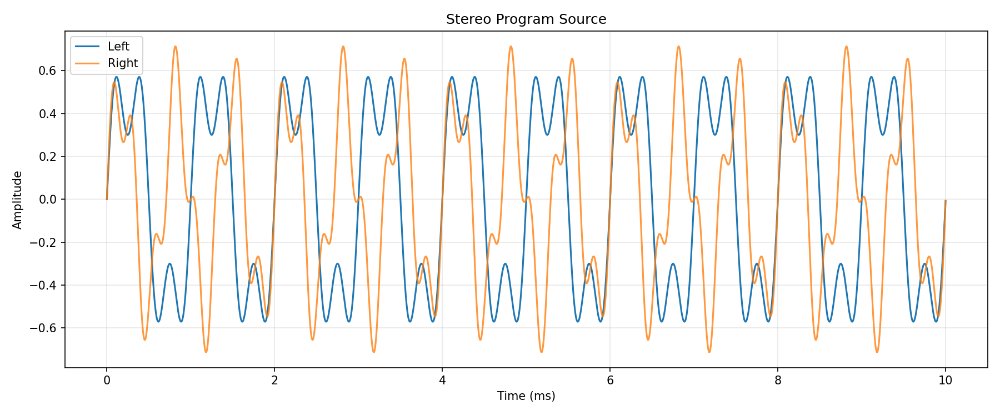
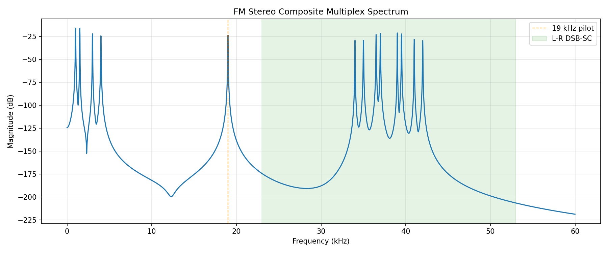
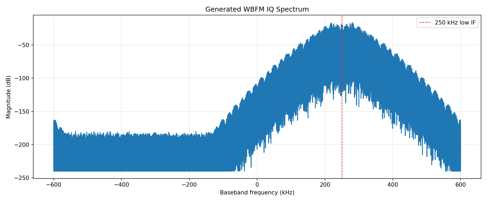
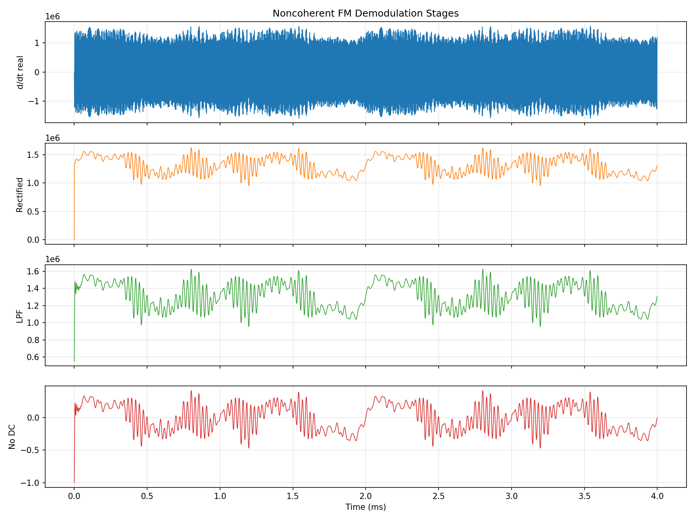
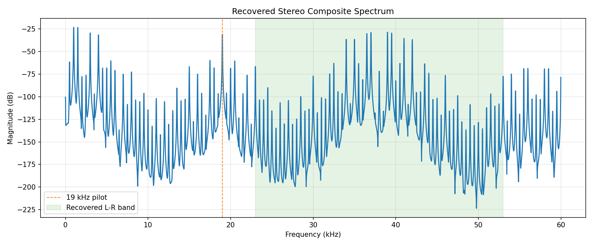
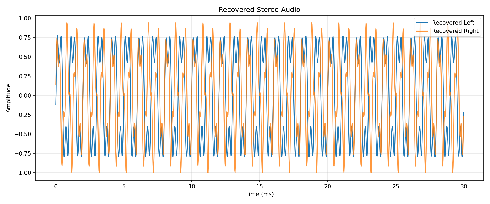

# WBFM 立体声广播信号调制与微分-包络型非相干解调仿真

## 摘要

本文使用 Python 对 88 MHz FM 立体声广播信号进行宽带调频（WBFM）调制、二进制 IQ 保存、二进制 IQ 读取和微分-包络型非相干解调仿真。仿真采用广播 FM 常用参数：最大频偏 75 kHz、19 kHz 立体声导频、38 kHz 抑制副载波、音频采样率 48 kHz、IQ 采样率 1.2 MS/s。

由于 88 MHz RF 载波不能直接用 1.2 MS/s 离散 IQ 表示，代码模拟的是接收机下变频后的解析 IQ 信号：88 MHz 电台被搬移到 250 kHz 低中频。保存文件 `FM_Modulation.iq` 使用 little-endian `int16 I, int16 Q` 交织格式，每个 IQ 复采样共 32 bit。

## 1. 仿真文件

| 文件 | 作用 |
| --- | --- |
| `fm_iq_io.py` | 读写 little-endian `int16 I/Q` 交织 IQ 文件 |
| `fm_modulation.py` | 生成立体声音频、FM 复合基带、WBFM IQ，并写入 `FM_Modulation.iq` |
| `fm_demodulation.py` | 读取 `FM_Modulation.iq`，执行微分-包络型四步 FM 解调和立体声恢复 |
| `FM_Modulation.iq` | Python 生成的二进制 IQ 数据 |
| `figures/*.png` | 调制与解调关键过程图表 |

运行方式：

```bash
python3 simulation/fm_modulation.py
python3 simulation/fm_demodulation.py
```

## 2. 系统参数

| 参数 | 数值 | 说明 |
| --- | ---: | --- |
| $f_c$ | 88 MHz | FM 广播 RF 载波 |
| $F_s$ | 1.2 MHz | 保存 IQ 的复采样率 |
| $f_\text{IF}$ | 250 kHz | 下变频后的低中频 |
| $F_a$ | 48 kHz | 恢复音频采样率 |
| $\Delta f_\text{max}$ | 75 kHz | WBFM 最大频偏 |
| $f_p$ | 19 kHz | 立体声导频 |
| $f_s$ | 38 kHz | 立体声差分副载波 |
| $B_a$ | 15 kHz | 单声道音频低通带宽 |
| $B_c$ | 100 kHz | FM 复合基带低通带宽 |

## 3. 立体声复合基带模型

设左右声道音频为 $L(t)$ 与 $R(t)$，其带宽限制在约 15 kHz 内。FM 广播需要同时满足两个目标：第一，老式单声道接收机只用低通滤波就能听到完整节目；第二，立体声接收机可以从同一段复合基带中恢复左右声道。因此发射端不直接发送 $L(t)$ 与 $R(t)$，而是先做和差信号变换。

和差信号定义为：

$$
m_+(t)=\frac{L(t)+R(t)}{2}
$$

$$
m_-(t)=\frac{L(t)-R(t)}{2}
$$

其中 $m_+(t)$ 是单声道兼容信号。单声道收音机只保留 0-15 kHz 低频部分，听到的就是 $L+R$ 节目内容。$m_-(t)$ 是左右声道的差异信息；立体声接收机只要同时得到 $m_+(t)$ 和 $m_-(t)$，即可用矩阵还原：

$$
L(t)=m_+(t)+m_-(t)
$$

$$
R(t)=m_+(t)-m_-(t)
$$

为了避免 $m_-(t)$ 与 0-15 kHz 的 $m_+(t)$ 频谱重叠，FM 立体声制式把 $m_-(t)$ 搬移到 38 kHz 附近。这个搬移使用双边带抑制载波（DSB-SC）形式：

$$
m_-(t)\cos(2\pi f_s t),\quad f_s=38\,000
$$

如果 $m_-(t)$ 的最高频率为 15 kHz，则调制后频谱位于：

$$
38\,\text{kHz}-15\,\text{kHz}=23\,\text{kHz}
$$

到：

$$
38\,\text{kHz}+15\,\text{kHz}=53\,\text{kHz}
$$

因此，复合基带中 0-15 kHz 与 23-53 kHz 之间留出了频谱间隔。接收端再乘以同频同相的 38 kHz 本振，并低通到 15 kHz，即可把 $L-R$ 搬回基带。

实际广播中 38 kHz 副载波本身被抑制，发射端只发送 19 kHz 导频。接收端通过锁相环或倍频从 19 kHz 导频恢复 38 kHz 副载波。本仿真为了突出调制与解调主链路，解码时直接使用已知 38 kHz 本振；文档仍保留 19 kHz 导频，以匹配真实 FM 立体声广播的频谱结构。

FM 立体声广播复合基带由三部分组成：

1. 兼容单声道分量 $L+R$；
2. 19 kHz 导频；
3. 调制到 38 kHz 抑制副载波附近的 $L-R$ 差分分量。

代码中使用归一化形式：

$$
m(t)=0.90m_+(t)+0.10\sin(2\pi f_p t)+0.90m_-(t)\cos(2\pi f_s t)
$$

其中：

$$
f_p=19\,000,\quad f_s=38\,000
$$

式中的 0.90 与 0.10 是仿真中的幅度权重，用于避免复合基带过载并让导频在频谱图中清晰可见。真实广播系统还会涉及预加重、限幅、导频注入比例和 RDS/RBDS 等工程细节；本仿真聚焦于 WBFM 立体声主业务。

生成的左右声道音频如下。左声道由 1 kHz 和 3 kHz 分量组成，右声道由 1.5 kHz 和 4 kHz 分量组成，因此两路波形不同，便于验证立体声恢复是否真的区分了左右声道。



复合基带频谱如下。0-15 kHz 为 $L+R$，19 kHz 为导频，23-53 kHz 为 $L-R$ 双边带抑制载波区域。图中可见导频是窄带谱线，而 $L-R$ 信息被搬移到 38 kHz 两侧；这正是立体声广播兼容单声道接收机的关键。



## 4. WBFM 调制

FM 信号的信息由瞬时频率承载。理想 RF 信号可写为：

$$
s_\text{RF}(t)=A_c\cos\left(2\pi f_c t+2\pi\Delta f_\text{max}\int_0^t m(\tau)d\tau\right)
$$

其中 $f_c=88\,\text{MHz}$。保存到文件中的 IQ 是下变频到低中频后的解析信号：

$$
x(t)=\exp\left(j\left[2\pi f_\text{IF}t+2\pi\Delta f_\text{max}\int_0^t m(\tau)d\tau\right]\right)
$$

离散化后：

$$
x[n]=\exp\left(j\left[2\pi f_\text{IF}\frac{n}{F_s}
+2\pi\Delta f_\text{max}\sum_{k=0}^{n}\frac{m[k]}{F_s}\right]\right)
$$

瞬时频率为：

$$
f_i[n]=f_\text{IF}+\Delta f_\text{max}m[n]
$$

由于 $f_\text{IF}=250\,\text{kHz}$ 且 $\Delta f_\text{max}=75\,\text{kHz}$，瞬时频率始终为正，适合使用微分-包络型非相干 FM 解调。

生成 IQ 的频谱如下：



## 5. IQ 二进制格式

`FM_Modulation.iq` 的交互格式为：

```text
I0(int16), Q0(int16), I1(int16), Q1(int16), ...
```

每个分量是 little-endian signed 16-bit integer：

$$
I_n,Q_n\in[-32768,32767]
$$

每个复采样由一个 $I_n$ 和一个 $Q_n$ 组成：

$$
x[n]=\frac{I_n}{32768}+j\frac{Q_n}{32768}
$$

因此每个 IQ 复采样占：

$$
16\,\text{bit}+16\,\text{bit}=32\,\text{bit}
$$

## 6. 微分-包络型非相干 FM 解调

严格地说，普通 FM 信号是恒包络信号，不能像 AM 那样直接对原始 FM 波形做包络检波得到音频。本文使用的是“先微分、再包络检波”的斜率鉴频思想：微分器把瞬时频率变化转换为微分输出的幅度变化，然后全波整流或取复幅度相当于包络检波，最后低通和去直流得到调制信号。因此它可以称为微分-包络型非相干 FM 解调，也可视为一种斜率鉴频实现。

本文按指定的四个步骤进行解调。输入为低中频解析 IQ：

$$
x(t)=e^{j\phi(t)}
$$

其中：

$$
\phi(t)=2\pi f_\text{IF}t+2\pi\Delta f_\text{max}\int_0^t m(\tau)d\tau
$$

瞬时角频率为：

$$
\omega_i(t)=\frac{d\phi(t)}{dt}=2\pi\left[f_\text{IF}+\Delta f_\text{max}m(t)\right]
$$

### 6.1 求微分

对 IQ 信号求导：

$$
\frac{dx(t)}{dt}=j\frac{d\phi(t)}{dt}e^{j\phi(t)}
$$

离散实现为一阶差分：

$$
d[n]=F_s\left(x[n]-x[n-1]\right)
$$

微分步骤的作用是把相位变化率显式变成幅度项。对于 $x(t)=e^{j\phi(t)}$，微分后仍包含原来的旋转项 $e^{j\phi(t)}$，但幅度被 $\frac{d\phi(t)}{dt}$ 调制。也就是说，原先藏在相位中的 FM 信息，被转换到了微分信号的包络中。

### 6.2 全波整流

微分后信号幅度近似与瞬时角频率成比例：

$$
\left|\frac{dx(t)}{dt}\right|=\left|\omega_i(t)\right|
$$

因为本仿真保证 $f_\text{IF}+\Delta f_\text{max}m(t)>0$，所以：

$$
r[n]=|d[n]|\approx 2\pi\left[f_\text{IF}+\Delta f_\text{max}m[n]\right]
$$

这里的全波整流在复 IQ 实现中写为取模 $|d[n]|$。如果使用实低中频信号，也可以理解为对微分后的实信号做全波整流，再通过低通提取包络。因此，“包络检波”更准确地对应这一步，而不是对原始 FM 信号直接检波。

### 6.3 低通滤波

整流后包含目标复合基带和高频项。用 100 kHz FIR 低通保留 FM 立体声复合基带：

$$
u[n]=\sum_{k=0}^{N-1}h[k]r[n-k]
$$

FIR 使用 windowed-sinc 与 Hamming 窗：

$$
h_\text{ideal}[n]=2f_\text{norm}\operatorname{sinc}(2f_\text{norm}(n-M))
$$

$$
w[n]=0.54-0.46\cos\left(\frac{2\pi n}{N-1}\right)
$$

$$
h[n]=\frac{h_\text{ideal}[n]w[n]}{\sum_{k=0}^{N-1}h_\text{ideal}[k]w[k]}
$$

低通滤波的截止频率选为 100 kHz，是因为 FM 立体声主复合基带主要位于 0-53 kHz，并且实际广播还可能包含更高的附加业务。100 kHz 可以保留完整立体声复合基带，同时抑制整流后产生的高频纹波和离散差分带来的高频分量。

### 6.4 去直流

低通输出仍包含由低中频带来的直流项：

$$
u[n]\approx 2\pi f_\text{IF}+2\pi\Delta f_\text{max}m[n]
$$

去除均值并归一化：

$$
\hat{m}[n]=\frac{u[n]-\operatorname{mean}(u[n])}{\max|u[n]-\operatorname{mean}(u[n])|}
$$

去直流步骤非常关键。微分-包络检波得到的是瞬时频率的幅度估计，其中包含一个很大的常量 $2\pi f_\text{IF}$。真正的广播复合基带只对应围绕该常量上下摆动的部分，即 $2\pi\Delta f_\text{max}m[n]$。去均值后，输出才以 0 为中心，适合后续 15 kHz 单声道低通、23-53 kHz 差分带通和立体声矩阵恢复。

四个解调阶段的时域结果如下：



图中四个子图从上到下对应以下含义：

1. 微分输出：波形仍带有明显的低中频快速振荡，幅度随瞬时频率变化。因为显示的是微分后复信号实部，所以能看到高频载波式摆动。
2. 全波整流输出：负半周被翻转为正值，快速振荡被转换成正包络。此时包络已经含有原始 FM 复合基带信息，但还叠加明显的整流纹波。
3. 低通滤波输出：高频纹波被压低，只剩缓慢变化的包络趋势。该趋势近似等于 $2\pi f_\text{IF}+2\pi\Delta f_\text{max}m[n]$，因此整体仍处在正直流附近。
4. 去直流输出：移除低中频造成的直流分量后，波形围绕 0 上下变化，这就是恢复出的 FM 立体声复合基带估计 $\hat{m}[n]$。

需要注意，这张图展示的是前 4 ms 的时域细节。由于复合基带包含 19 kHz 导频和 23-53 kHz 的 $L-R$ 副载波分量，去直流后的波形并不会像普通单音音频那样平滑；它是单声道音频、导频和立体声差分副载波的叠加结果。后续频谱图能更清楚地分辨这些组成部分。

恢复出的复合基带频谱如下：



## 7. 立体声恢复

对微分-包络型解调得到的 $\hat{m}[n]$ 继续恢复左右声道。

单声道分量：

$$
\hat{m}_+[n]=\operatorname{LPF}_{15k}\{\hat{m}[n]\}
$$

差分分量先取 23-53 kHz 带通：

$$
b[n]=\operatorname{BPF}_{23k,53k}\{\hat{m}[n]\}
$$

然后用 38 kHz 本振相乘并低通：

$$
\hat{m}_-[n]=\operatorname{LPF}_{15k}\{2b[n]\cos(2\pi f_s n/F_s)\}
$$

最后合成立体声：

$$
\hat{L}[n]=\hat{m}_+[n]+\hat{m}_-[n]
$$

$$
\hat{R}[n]=\hat{m}_+[n]-\hat{m}_-[n]
$$

恢复音频如下：



## 8. 符号对照表

| 符号 | 含义 | 代码对应 |
| --- | --- | --- |
| $f_c$ | RF 载波频率 | `CARRIER_HZ = 88_000_000` |
| $F_s$ | IQ 采样率 | `IQ_SAMPLE_RATE_HZ = 1_200_000` |
| $F_a$ | 音频采样率 | `AUDIO_SAMPLE_RATE_HZ = 48_000` |
| $f_\text{IF}$ | 下变频后的低中频 | `LOW_IF_HZ = 250_000` |
| $\Delta f_\text{max}$ | FM 最大频偏 | `FM_DEVIATION_HZ = 75_000` |
| $f_p$ | 立体声导频频率 | `PILOT_HZ = 19_000` |
| $f_s$ | 立体声副载波频率 | `STEREO_SUBCARRIER_HZ = 38_000` |
| $L(t)$ | 左声道音频 | `left` |
| $R(t)$ | 右声道音频 | `right` |
| $m_+(t)$ | 单声道兼容分量 | `mono` |
| $m_-(t)$ | 立体声差分分量 | `diff` |
| $m(t)$ | FM 立体声复合基带 | `composite` |
| $s_\text{RF}(t)$ | RF WBFM 信号 | 文档公式 |
| $x[n]$ | 保存的复 IQ 采样 | `iq` |
| $I_n$ | 第 $n$ 个 int16 I 分量 | `raw[0::2]` |
| $Q_n$ | 第 $n$ 个 int16 Q 分量 | `raw[1::2]` |
| $\phi(t)$ | FM 瞬时相位 | `phase` |
| $f_i[n]$ | 瞬时频率 | `LOW_IF_HZ + FM_DEVIATION_HZ * composite` |
| $d[n]$ | 微分输出 | `differentiated` |
| $r[n]$ | 全波整流输出 | `rectified` |
| $u[n]$ | 低通滤波输出 | `lowpassed` |
| $\hat{m}[n]$ | 去直流后的复合基带估计 | `dc_removed` / `composite` |
| $h[n]$ | FIR 滤波器系数 | `lowpass_fir()` |
| $N$ | FIR tap 数 | `taps` |
| $\hat{L}[n]$ | 恢复左声道 | `left` in demod script |
| $\hat{R}[n]$ | 恢复右声道 | `right` in demod script |

## 9. 结论

仿真完成了从立体声广播复合基带生成、WBFM 调制、`int16 I/Q` 二进制保存，到读取 IQ 后使用微分-包络型四步法恢复 FM 复合基带和左右声道音频的完整流程。该方法依赖低中频瞬时频率保持正值；如果直接对零中频 FM IQ 使用微分后取模，包络幅度会丢失频偏正负号，因此本仿真将 88 MHz 电台下变频到 250 kHz 低中频后再保存 IQ。
