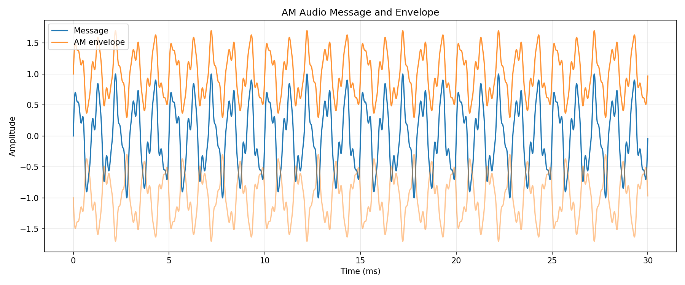
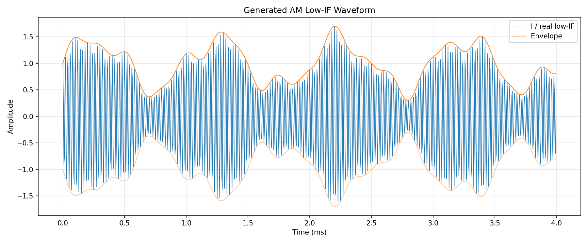
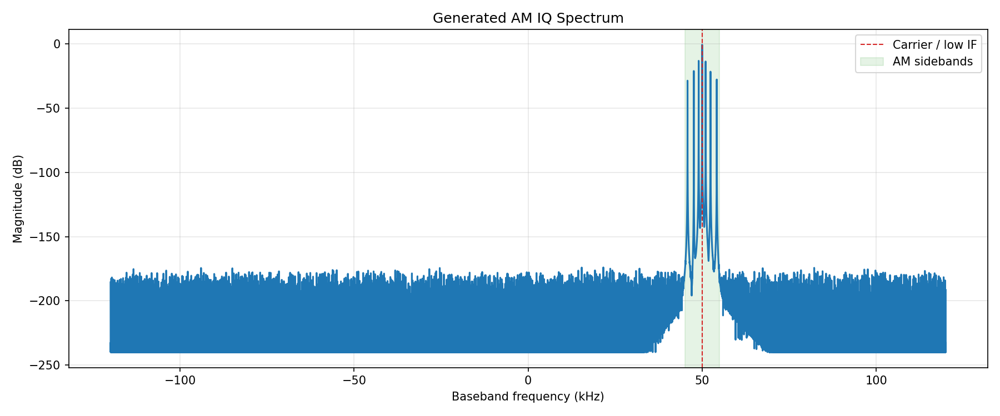
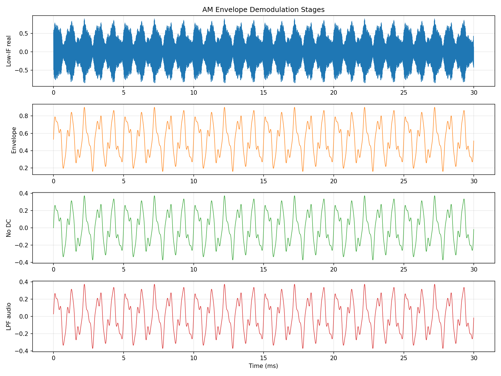
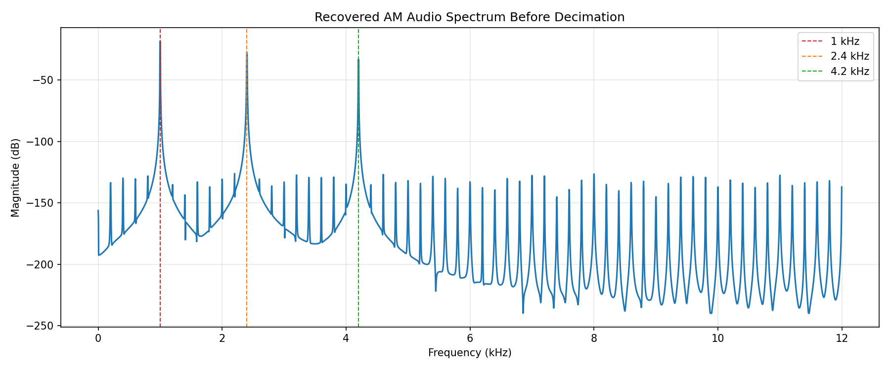
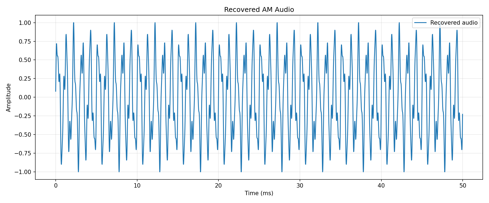

# AM 广播信号调制与包络解调仿真

## 摘要

本文使用 Python 对常规 AM 信号进行调制、二进制 IQ 保存、IQ 读取和包络解调仿真。仿真重点是说明 AM 与 FM 的关键差异：AM 把信息写入载波幅度，因此可以直接通过包络检波恢复音频；FM 把信息写入瞬时频率，需要鉴频或相位差分。

为了方便离散 IQ 表示，文档中的 RF 载波设为 `1 MHz`，代码模拟的是接收机下变频后的低中频 IQ，低中频为 `50 kHz`，IQ 采样率为 `240 kS/s`。保存文件 `AM_Modulation.iq` 使用 little-endian `int16 I, int16 Q` 交织格式。

## 1. 仿真文件

| 文件 | 作用 |
| --- | --- |
| `am_iq_io.py` | 读写 little-endian `int16 I/Q` 交织 IQ 文件 |
| `am_modulation.py` | 生成音频消息、常规 AM 低中频 IQ，并写入 `AM_Modulation.iq` |
| `am_demodulation.py` | 读取 `AM_Modulation.iq`，执行包络检波、去直流、低通和降采样 |
| `AM_Modulation.iq` | Python 生成的二进制 IQ 数据 |
| `figures/*.png` | 调制与解调关键过程图表 |

运行方式：

```bash
python3 simulation/am/am_modulation.py
python3 simulation/am/am_demodulation.py
```

## 2. 系统参数

| 参数 | 数值 | 说明 |
| --- | ---: | --- |
| $f_c$ | 1 MHz | 示例 RF 载波 |
| $F_s$ | 240 kHz | 保存 IQ 的复采样率 |
| $f_\text{IF}$ | 50 kHz | 下变频后的低中频 |
| $F_a$ | 48 kHz | 恢复音频采样率 |
| $\mu$ | 0.70 | AM 调制度 |
| $B_a$ | 8 kHz | 音频低通截止频率 |

## 3. AM 调制模型

设归一化消息信号为 $m(t)$，满足：

$$
-1 \le m(t) \le 1
$$

常规带载波 AM 可写为：

$$
s(t)=A_c[1+\mu m(t)]\cos(2\pi f_ct)
$$

其中 $\mu$ 是调制度。只要 $\mu \le 1$，包络：

$$
e(t)=A_c[1+\mu m(t)]
$$

始终不为负，接收端可以通过包络检波恢复 $m(t)$。如果 $\mu > 1$，包络会交叉或反相，称为过调制，简单包络检波会产生明显失真。

本仿真保存的是下变频后的解析 IQ：

$$
x(t)=[1+\mu m(t)]e^{j2\pi f_\text{IF}t}
$$

代码中消息信号由 1 kHz、2.4 kHz 和 4.2 kHz 三个音频分量组成。调制度设置为 `0.70`，故包络最低值约为 `0.30`，不会过调制。

调制消息和包络如下：



低中频 AM 波形如下，橙色曲线标出了上下包络：



生成的 IQ 频谱如下。中心处为低中频载波，载波两侧是消息信号产生的上下边带：



## 4. IQ 二进制格式

`AM_Modulation.iq` 的交织格式为：

```text
I0(int16), Q0(int16), I1(int16), Q1(int16), ...
```

读取时归一化为：

$$
x[n]=\frac{I_n}{32768}+j\frac{Q_n}{32768}
$$

每个 IQ 复采样由一个 16-bit I 分量和一个 16-bit Q 分量组成，共 32 bit。

## 5. 包络解调

AM 解调链路使用四个步骤：

1. 包络检波；
2. 去直流；
3. 音频低通；
4. 降采样到 48 kHz。

### 5.1 包络检波

对低中频 IQ 取复幅度：

$$
r[n]=|x[n]|
$$

由于：

$$
x[n]=[1+\mu m[n]]e^{j2\pi f_\text{IF}n/F_s}
$$

而复指数幅度为 1，所以：

$$
r[n]=1+\mu m[n]
$$

这一步正是 AM 比 FM 更容易直接解调的原因：信息本身就在幅度包络里。

### 5.2 去直流

包络中的常量 1 对应未调制载波幅度，不是音频内容。去除均值：

$$
u[n]=r[n]-\operatorname{mean}(r[n])
$$

得到以 0 为中心的音频估计。

### 5.3 低通滤波

音频低通保留 0-8 kHz：

$$
y[n]=\sum_{k=0}^{N-1}h[k]u[n-k]
$$

代码使用 Hamming-windowed sinc FIR。低通可以抑制量化噪声、包络估计纹波和音频带外分量。

### 5.4 降采样

仿真 IQ 采样率为 240 kS/s，音频目标采样率为 48 kS/s，因此低通后按 5 倍降采样：

$$
y_a[n]=y[5n]
$$

包络解调阶段图如下：



恢复音频频谱如下，可以看到 1 kHz、2.4 kHz 和 4.2 kHz 三个消息分量：



恢复音频波形如下：



## 6. 符号对照表

| 符号 | 含义 | 代码对应 |
| --- | --- | --- |
| $f_c$ | RF 载波频率 | `CARRIER_HZ = 1_000_000` |
| $F_s$ | IQ 采样率 | `IQ_SAMPLE_RATE_HZ = 240_000` |
| $F_a$ | 音频采样率 | `AUDIO_SAMPLE_RATE_HZ = 48_000` |
| $f_\text{IF}$ | 下变频后的低中频 | `LOW_IF_HZ = 50_000` |
| $\mu$ | AM 调制度 | `MODULATION_INDEX = 0.70` |
| $m(t)$ | 归一化音频消息 | `audio` |
| $e(t)$ | AM 包络 | `envelope` |
| $x[n]$ | 保存的复 IQ 采样 | `iq` |
| $r[n]$ | 包络检波输出 | `envelope` in demod script |
| $u[n]$ | 去直流后的音频估计 | `dc_removed` |
| $y[n]$ | 低通后的宽采样率音频 | `audio_wide` |
| $y_a[n]$ | 降采样后的恢复音频 | `audio` in demod script |

## 7. 结论

AM 仿真展示了带载波调幅的完整流程：消息信号控制载波幅度，接收端通过复 IQ 取模即可得到包络，再去直流和低通即可恢复音频。该方法适用于未过调制的常规 AM；若调制度超过 1，或者接收链路中载波严重衰落，简单包络检波会失真，需要同步检波等更稳健的方法。
